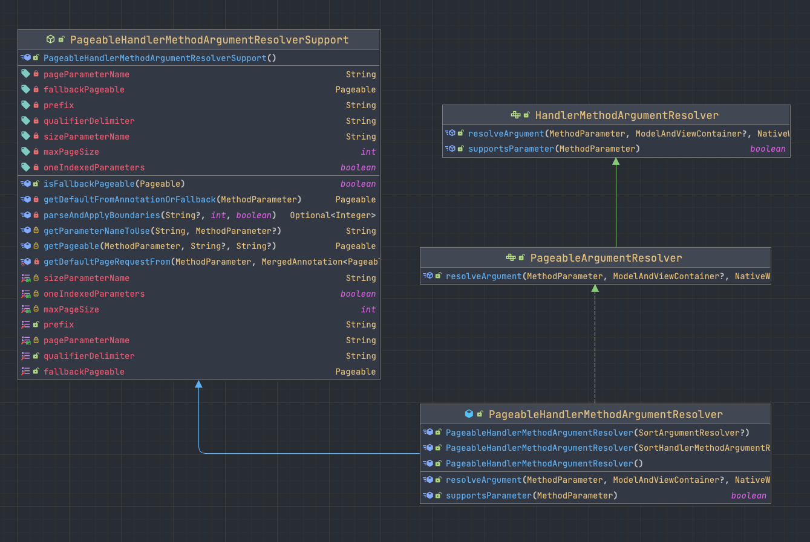

# Spring, Pageable, JPA

Spring Data JPA, Pageable

> ### Pageable, Pagination


- Pagination
  - 정렬 방식, 페이지 크기, 몇 번째 페이지인지의 요청 정보


- Pageable
  - JPA에서는 `Pageable` 객체를 제공한다.
  - 페이지 요청 정보를 편하게 사용할 수 있도록 해주는 객체이다.


- 다음과 같이 페이지 정보를 요청하는 QueryParameter이다.
  - id 내림차순 정렬
  - 1쪽 10개의 글
  - 글 구성의 3번째 페이지 정보
```
page=1&size=10&sort=id,DESC
```

Pageable에 대해서 더 알기 위해 PageableHandlerMethodArgumentResolver를 보도록 하자.

> ### PageableHandlerMethodArgumentResolver



```java
package org.springframework.data.web;

public class PageableHandlerMethodArgumentResolver
        extends PageableHandlerMethodArgumentResolverSupport
        implements PageableArgumentResolver {

    // ...

    @Override
    public boolean supportsParameter(MethodParameter parameter) {
        return Pageable.class.equals(parameter.getParameterType());
    }

    @Override
    public Pageable resolveArgument(MethodParameter methodParameter, 
                                    @Nullable ModelAndViewContainer mavContainer,
                                    NativeWebRequest webRequest, 
                                    @Nullable WebDataBinderFactory binderFactory
    ) {

        String page = webRequest.getParameter(getParameterNameToUse(getPageParameterName(), methodParameter));
        String pageSize = webRequest.getParameter(getParameterNameToUse(getSizeParameterName(), methodParameter));

        Sort sort = sortResolver.resolveArgument(methodParameter, mavContainer, webRequest, binderFactory);
        Pageable pageable = getPageable(methodParameter, page, pageSize);

        if (sort.isSorted()) {
            return PageRequest.of(pageable.getPageNumber(), pageable.getPageSize(), sort);
        }

        return pageable;
    }
}
```

- `page=1&size=10&sort=id,DESC` 은 Pageable 객체로 변환된다.
  - Pageable에 파라미터가 오면, resolveArgument() 메서드가 실행되어 Pageable 객체를 반환한다.


- Pageable에 아무런 값도 오지 않는 다면
  - 정렬되지 않은 20개씩 나눠진 첫 페이지를 반환한다.
  - `fallbackPageable`을 반환한다.

```java
package org.springframework.data.web;

public abstract class PageableHandlerMethodArgumentResolverSupport {

  private static final String INVALID_DEFAULT_PAGE_SIZE = "Invalid default page size configured for method %s; Must not be less than one";

  private static final String DEFAULT_PAGE_PARAMETER = "page";
  private static final String DEFAULT_SIZE_PARAMETER = "size";
  private static final String DEFAULT_PREFIX = "";
  private static final String DEFAULT_QUALIFIER_DELIMITER = "_";
  private static final int DEFAULT_MAX_PAGE_SIZE = 2000;
  static final Pageable DEFAULT_PAGE_REQUEST = PageRequest.of(0, 20);

  private Pageable fallbackPageable = DEFAULT_PAGE_REQUEST;
  private String pageParameterName = DEFAULT_PAGE_PARAMETER;
  private String sizeParameterName = DEFAULT_SIZE_PARAMETER;
  private String prefix = DEFAULT_PREFIX;
  private String qualifierDelimiter = DEFAULT_QUALIFIER_DELIMITER;
  private int maxPageSize = DEFAULT_MAX_PAGE_SIZE;
  private boolean oneIndexedParameters = false;

  //...
  
  private Pageable getDefaultFromAnnotationOrFallback(MethodParameter methodParameter) {

    MergedAnnotation<PageableDefault> defaults = MergedAnnotations.from(methodParameter.getParameterAnnotations())
            .get(PageableDefault.class);

    if (defaults.isPresent()) {
      return getDefaultPageRequestFrom(methodParameter, defaults);
    }

    return fallbackPageable;
  }

  protected Pageable getPageable(MethodParameter methodParameter, @Nullable String pageString,
                                 @Nullable String pageSizeString) {
    assertPageableUniqueness(methodParameter);

    Optional<Pageable> defaultOrFallback = getDefaultFromAnnotationOrFallback(methodParameter).toOptional();

    Optional<Integer> page = parseAndApplyBoundaries(pageString, Integer.MAX_VALUE, true);
    Optional<Integer> pageSize = parseAndApplyBoundaries(pageSizeString, maxPageSize, false);

    if (!(page.isPresent() && pageSize.isPresent()) && !defaultOrFallback.isPresent()) {
      return Pageable.unpaged();
    }

    int p = page
            .orElseGet(() -> defaultOrFallback.map(Pageable::getPageNumber).orElseThrow(IllegalStateException::new));
    int ps = pageSize
            .orElseGet(() -> defaultOrFallback.map(Pageable::getPageSize).orElseThrow(IllegalStateException::new));

    // Limit lower bound
    ps = ps < 1 ? defaultOrFallback.map(Pageable::getPageSize).orElseThrow(IllegalStateException::new) : ps;
    // Limit upper bound
    ps = ps > maxPageSize ? maxPageSize : ps;

    return PageRequest.of(p, ps, defaultOrFallback.map(Pageable::getSort).orElseGet(Sort::unsorted));
  }

  // ...
}
```

> ### @PageableDefault

- `PageableHandlerMethodArgumentResolverSupport`
  - `getDefaultFromAnnotationOrFallback()` 메서드에서 `@PageableDefault` 어노테이션이 붙어있는 경우
  - `fallbackPageable`이 아닌 `@PageableDefault` 어노테이션 설정대로 사용자에게 보내준다.

```java
@RestController
public class PostController {

    @GetMapping
    public List<PostResponse> getPosts(
            @PageableDefault(size = 30, sort = "id", direction = DESC) Pageable pageable
    ) {
        // ...
    }
}
```

> ### DefaultPage, FallbackPage

- DefaultPage
  - @PageableDefault
  - 개발자가 정한 기본 Pge
- FallbackPage
  - 별도 어노테이션이 없다면 FallbackPage 설정으로 실행된다.


---

## 참고

- [테코볼 - Pageable을 이용한 Pagination을 처리하는 다양한 방법
  ](https://tecoble.techcourse.co.kr/post/2021-08-15-pageable/)