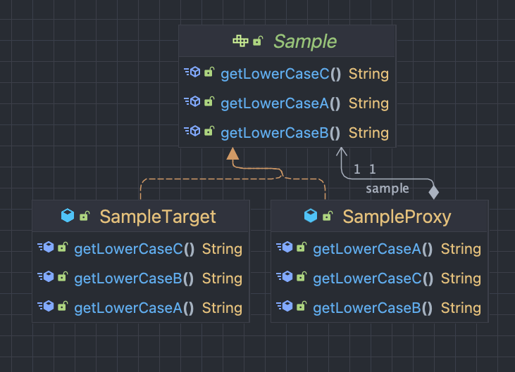

# Proxy

- 프록시에 대해서 알아봅니다.
- 프록시 패턴을 이용해봅니다.
- CGLIB를 이용해봅니다.


## Proxy ?

> proxy : 대리자, 대변인
> 
> - 누군가를 대신해서 그 역할을 수행하는 존재를 의미한다.

- 클라이언트부터 대신해서 요청 받는다.
- 실제 오브젝트는 프록시를 통해서 최종 요청을 처리한다.
- 즉, 부가적인 기능은 프록시가 처리한다.

## 프록시 패턴

> ✅ 프록시 패턴을 이용했을 때
> 
> 👍 GOOD
> - OCP 를 지킬 수 있다.
> - SRP 를 지킬 수 있다.
> 
> 👎 BAD
> - 코드 복잡성이 증가한다.
> - 중복 코드가 발생한다.
> 

- 프록시 패턴

 ```java
 public class SampleProxy implements Sample {
 
     private Sample sample;
 
     public SampleProxy(Sample sample) {
         this.sample = sample;
     }
 
     @Override
     public String getLowerCaseA() {
         return sample.getLowerCaseA().toUpperCase();
     }
 
     @Override
     public String getLowerCaseB() {
         return sample.getLowerCaseB().toUpperCase();
     }
 
     @Override
     public String getLowerCaseC() {
         return sample.getLowerCaseC().toUpperCase();
     }
 }
 ```

- 프록시 패턴 테스트 코드

```java
@Test
@DisplayName("프록시 패턴을 이용하여 소문자 반환이 아닌 대문자 반환에 성공한다.")
void sample_proxy_pattern_test() {
    // given
    Sample sample = new SampleProxy(new SampleTarget());

    // when
    String a = sample.getLowerCaseA();
    String b = sample.getLowerCaseB();
    String c = sample.getLowerCaseC();

    // then
    assertThat(a).isEqualTo("A");
    assertThat(b).isEqualTo("B");
    assertThat(c).isEqualTo("C");
}
```



## Jdk Dynamic Proxy

> 
> ✅ JDK에서 지원하는 프록시
> 
> - Reflection API 이용
> - 인터페이스가 있어야 한다.
> - InvocationHandler 를 오버라이딩 해야한다.
> 

- reflect 의 invocationHandler 구현

 ```java
import java.lang.reflect.InvocationHandler;
import java.lang.reflect.Method;

 public class UpperCaseInvocationHandler implements InvocationHandler {
 
     private final Object target;
 
     public UpperCaseInvocationHandler(Object target) {
         this.target = target;
     }
 
     @Override
     public Object invoke(Object proxy, Method method, Object[] args) throws Throwable {
         if (method.getName().startsWith("getLowerCase")) {
             return ((String) method.invoke(target, args)).toUpperCase();
         }
         return method.invoke(target, args);
     }
 }
 ```
 
- Jdk Dynamic Proxy 테스트 코드
 
```java
 @Test 
 @DisplayName("메서드 이름이 getLowerCase로 시작하면 jdk 프록시가 동작하며 소문자 반환이 아닌 대문자 반환에 성공한다.")
 void jdk_dynamic_proxy_test() {
    // given
    Sample sample = (Sample) Proxy.newProxyInstance(
            JdkDynamicProxyTest.class.getClassLoader(),
            new Class[] {Sample.class},
            new UpperCaseInvocationHandler(new SampleTarget())
    );

    // when
    String a = sample.getLowerCaseA();
    String b = sample.getLowerCaseB();
    String c = sample.getLowerCaseC();

    // then
    assertThat(a).isEqualTo("A");
    assertThat(b).isEqualTo("B");
    assertThat(c).isEqualTo("C");
 }
```

## CGLIB Proxy

> 
> ✅ CGLIB 를 이용한 proxy
> 
> - 인터페이스에도 강제로 적용 가능하다.
>   - 클래스에도 프록시를 적용시켜야 한다.
> - 메서드에 final 을 붙이면 오버라이딩 불가능해서 실패한다.
> - net.sf.cglib.proxy.Enhancer 의존성 추가가 필요하다.
> - Default 생성자가 필요하다.
> - 타켓의 생성자를 두 번 호출한다.
> 

-  org.springframework.cglib.proxy.MethodInterceptor 구현

```java
import org.springframework.cglib.proxy.MethodInterceptor;
import org.springframework.cglib.proxy.MethodProxy;

import java.lang.reflect.Method;

public class UpperCaseInterceptor implements MethodInterceptor {

    private final Object target;

    public UpperCaseInterceptor(Object target) {
        this.target = target;
    }

    @Override
    public Object intercept(Object obj, Method method, Object[] args, MethodProxy proxy) throws Throwable {
        if (method.getName().startsWith("getLowerCase")) {
            return ((String) method.invoke(target, args)).toUpperCase();
        }
        return method.invoke(target, args);
    }
}
```

- CGLIB Proxy 테스트 코드

```java
@Test
@DisplayName("메서드 이름이 getLowerCase로 시작하면 jdk 프록시가 동작하며 소문자 반환이 아닌 대문자 반환에 성공한다.")
void jdk_dynamic_proxy_test() {
    // given
    Sample sample = (Sample) Enhancer.create(
            Sample.class,
            new UpperCaseInterceptor(new SampleTarget())
    );

    // when
    String a = sample.getLowerCaseA();
    String b = sample.getLowerCaseB();
    String c = sample.getLowerCaseC();

    // then
    assertThat(a).isEqualTo("A");
    assertThat(b).isEqualTo("B");
    assertThat(c).isEqualTo("C");
}
```


# JDK Dynamic Proxy VS CGLIB

- JDK Dynamic Proxy
  - reflection api 를 사용한다.
    - CGLIB 보다 느리다.
  - 인터페이스가 필요하다.
- CGLIB
  - 바이트 코드를 조작하기에 빠르다.
  - 상속을 이용해서 프록시를 만든다.
  - 메서드에 final 이 없어야 한다.

## ProxyFactoryBean

> Spring에서 Proxy를 Bean으로 만들어주는 ProxyFactoryBean을 제공한다.

- 타겟의 인터페이스 정보가 필요없다.
- Proxy Bean 을 생성한다.
- MethodInterceptor 로 구현한다.

## ProxyFactoryBean 이 MethodInterceptor 를 이용하는 이유

- 부가 기능을 싱글톤으로 공유하여 사용한다.